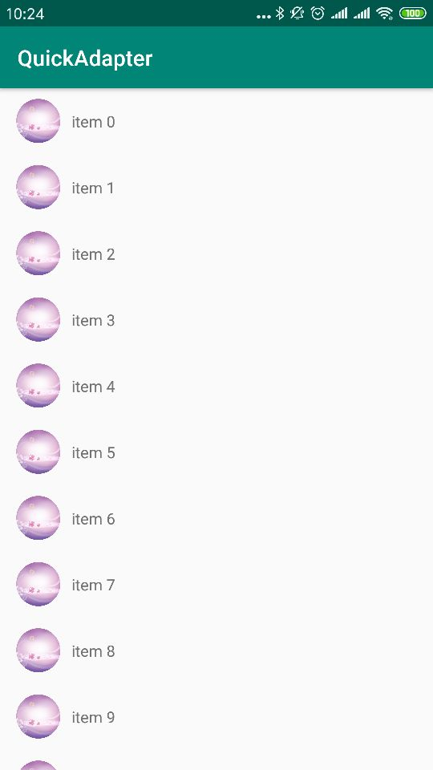

# XQuickAdapter
RecyclerView ListView GridView 通用适配器。

### 引入

```
allprojects {
		repositories {
			...
			maven { url 'https://jitpack.io' }
		}
	}


implementation 'com.github.wenkency:quickadapter:1.3.0'

```

### 使用方式
```
 mRecyclerView.setAdapter(new XQuickAdapter<String>(this, data, R.layout.item_recyler) {
            @Override
            protected void convert(XQuickViewHolder holder, String item, int position) {
                holder.setText(R.id.tv, "item " + position);
                holder.displayCircleImage(R.id.iv, item);
            }
        });
```

### 运行结果

